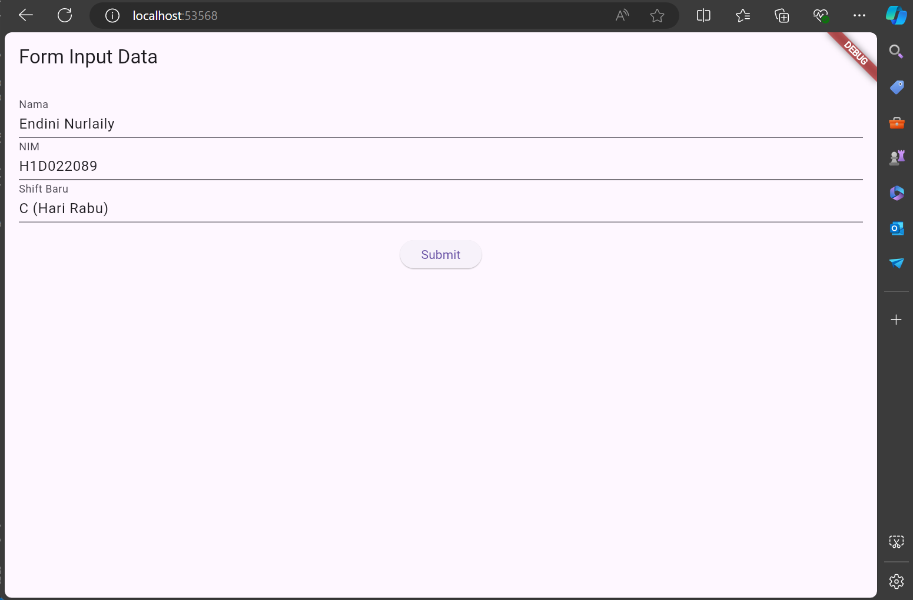

@@ -1,12 +1,23 @@
# Tugas Pertemuan 2

Nama: Endini Nurlaily

## Instruksi

1. **Fork dan Clone Repository**
   - Fork repository ini ke akun GitHub Anda.
   - Clone repository ke mesin lokal Anda dengan perintah:
     ```bash
     git clone https://github.com/username/ENDINI-NURLAILY_H1D022089_SHIFT-C_PEMPROGRAMANMOBILE2024.git
     ```
     (Ganti `username` dengan nama pengguna GitHub Anda.)

2. **Install Dependencies**
   - Navigasikan ke direktori proyek:
     ```bash
     cd ENDINI-NURLAILY_H1D022089_SHIFT-C_PEMPROGRAMANMOBILE2024
     ```
   - Jalankan perintah berikut untuk menginstal dependencies:
     ```bash
     flutter pub get
     ```

3. **Implementasi Form**
   - Buat tampilan form yang berisi `nama`, `NIM`, dan `shift baru` pada file `ui/form_data.dart`.
   - Buat tampilan hasil dari input data tersebut pada file `ui/tampil_data.dart`.

## Penjelasan Proses Passing Data

- **Form Data Input (ui/form_data.dart)**
  - Pengguna mengisi form dengan `nama`, `NIM`, dan `shift baru`.
  - Ketika tombol "Submit" ditekan, data dari form akan dikumpulkan dan dikirim ke tampilan hasil menggunakan `Navigator.push`.
## Screenshot

### Form Input


### Hasil Input

